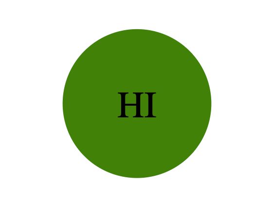

# SVG-Logo-Maker

## Description

This is a command-line application designed for freelance web developers who want to quickly generate simple logos for their projects. With this application, you can easily create logos with customizable text, text color, shape, and shape color. The generated logo will be saved as an SVG file, ready for use in your web projects.

## Installation 

Clone the repo: git clone https://github.com/alexandrazykova/SVG-Logo-Maker.git

Open in VS Code and integrated terminal.

To install necessary packages and librabies run the following command: npm i

To run the application, within the terminal, type the command node index.js

## Usage

Once the application is running, follow these steps to generate your logo:

You will be prompted to enter the text for your logo, text color by entering a color keyword or a hexadecimal color code, choose a shape for your logo by selecting from the provided options: circle, triangle, or square, choose shape colour.

After entering all the required information, the application will create an SVG file named logo.svg in the project directory.
You will see the message "Generated logo.svg" printed in the command line to confirm the logo has been created.
Your logo is now ready for use in your projects. You can open logo.svg in a web browser to view the 300x200 pixel image that matches the criteria you entered.

## Technologies used

- Node.js 
- inquirer v8.2.4 
- jest v29.6.4

## Demo

Walk through video (https://drive.google.com/file/d/1YYqsqCM05_YQL0Z_ZLbaEGjNjcvW0gcb/view?usp=sharing) 
## Examples

## Questions?

Reach out https://github.com/alexandrazykova
